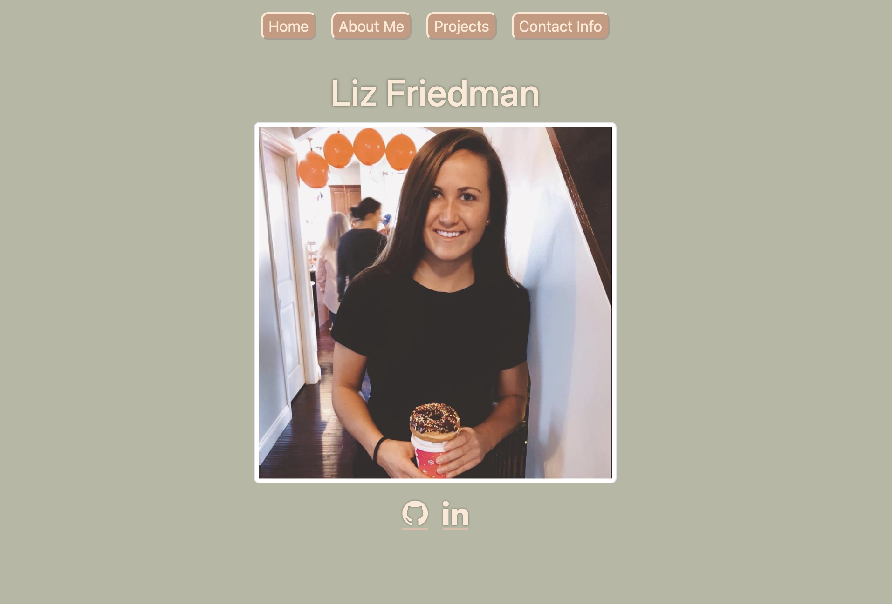
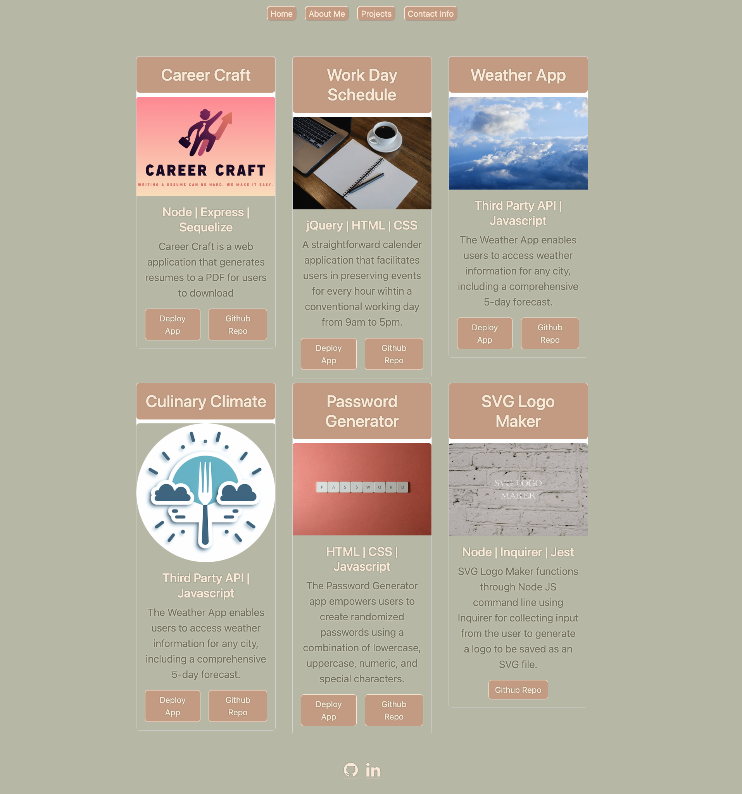

# Challenge 20: React Portfolio

## Description
An updated portfolio using React to showcase my web development projects. There are a total of six projects on display, an about me page, and a contact page. 

Link to deployment: [Netlify Deployment](https://netlify-friedman-react-portfolio.netlify.app/)

  ## Table of Contents
  * [Installation](#installation)
  * [Usage](#usage)
  * [License](#license)
  * [Badges](#badges)
  * [Contributions](#contributions)
  * [Questions](#questions)

## [Installation](#Table-of-Contents)
1. Clone this repo to your local computer by clicking the link to my [Github](https://github.com/lizf57/react-portfolio) then clicking the green drop down button that says "Code".
2. Install dependencies by typing `npm install` in the terminal's command line.

## [Usage](#table-of-contents)
1. To deploy this application, open the command line in the root of the project and type `npm run dev`. 

## [License](#table-of-contents)

## [Badges](#table-of-contents)

## [Contributions](#table-of-contents)
There were no other contributors to this application. This application was initiated as a project from the University of Wisconsin Coding Bootcamp. 

## [Questions](#Table-of-Contents)
If you have any questions contact the developer here:
L. Friedman:   [GitHub](https://github.com/lizf57)
